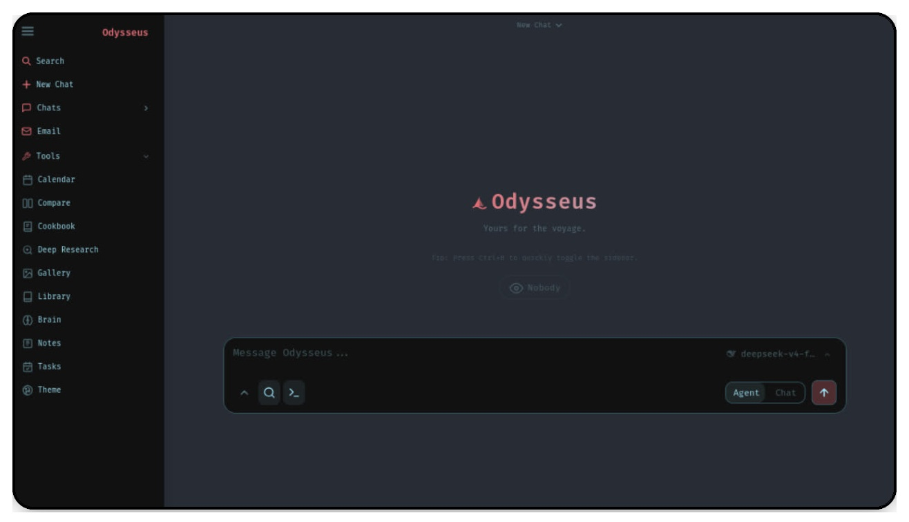

<p align="center">
  
</p>

<p align="center">
  A self-hosted AI workspace for chat, agents, research, documents, email, notes, calendar, and local model workflows.
</p>

<p align="center">
  <b>This fork adds first-class <a href="https://github.com/ml-explore/mlx">MLX</a> serving on Apple Silicon</b> —
  the fast native path on M-series Macs. See <a href="#mlx-on-apple-silicon-this-fork">MLX on Apple Silicon</a>.
</p>

<p align="center">
  <a href="#quick-start">Quick Start</a> ·
  <a href="docs/setup.md">Setup Guide</a> ·
  <a href="CONTRIBUTING.md">Contributing</a> ·
  <a href="ROADMAP.md">Roadmap</a>
</p>

<p align="center">
  <a href="https://repology.org/project/odysseus-ai/versions"></a>
</p>

<p align="center">
  
</p>

---

## Quick Start

> `dev` is the default branch and gets the newest changes first. Use [`main`](https://github.com/pewdiepie-archdaemon/odysseus/tree/main) if you want the more curated branch.

```bash
git clone https://github.com/pewdiepie-archdaemon/odysseus.git
cd odysseus
cp .env.example .env
docker compose up -d --build
```

Open `http://localhost:7000` when the containers are healthy. The first admin password is printed in `docker compose logs odysseus`.

Native installs, GPU notes, Windows/macOS instructions, HTTPS, and configuration live in the [setup guide](docs/setup.md).

## Features

- **Chat + Agents** — local/API models, tools, MCP, files, shell, skills, and memory.
- **Cookbook** — hardware-aware model recommendations, downloads, and serving.
- **Deep Research** — multi-step web research with source reading and report generation.
- **Compare** — blind side-by-side model testing and synthesis.
- **Documents** — writing-first editor with AI edits, suggestions, Markdown, HTML, CSV, and syntax highlighting.
- **Email** — IMAP/SMTP inbox with triage, tags, summaries, reminders, and reply drafts.
- **Notes, Tasks + Calendar** — reminders, todos, scheduled agent tasks, and CalDAV sync.
- **Extras** — gallery/image editor, themes, uploads, web search, presets, sessions, and 2FA.

## MLX on Apple Silicon (this fork)

On M-series Macs, MLX is the fastest local-inference path. This fork makes the
Cookbook a first-class MLX manager and adds a stable gateway in front of it, so
external tools (OpenCode, etc.) get one endpoint instead of N per-model ports:

- **Cookbook MLX backend** — serve any `mlx-community/*` (or other MLX) model
  with `mlx_lm.server`, straight from the model browser.
- **Budget-aware scheduler** — admission + priority/LRU eviction + idle-TTL keep
  concurrent MLX serves under the unified-memory budget instead of OOMing.
  Tune with `ODYSSEUS_MLX_BUDGET_MB` (defaults to detected Metal working set).
  Live budget/pin/unload controls show in the Cookbook's Running tab.
- **Unified gateway** — one OpenAI- and Ollama-compatible endpoint at
  `http://<host>:7860/mlx/v1` (and `/mlx/api`), with Qwen-family tool-call
  lifting and **on-demand auto-serve**: name a model in
  `data/mlx_autoserve.json` (see [`deploy/mlx_autoserve.example.json`](deploy/mlx_autoserve.example.json))
  and it launches on first request. Loopback is trusted; remote clients send a
  Bearer token (`ODYSSEUS_MLX_GATEWAY_KEY`). To use auto-served models from the
  built-in chat/model-picker, add a model endpoint pointing at
  `http://<host>:7860/mlx/v1` (Settings → Endpoints) — the gateway advertises
  every auto-serve name even before anything is loaded.
- **MLX embeddings (optional)** — serve an MLX embedding model and point
  `EMBEDDING_URL` at it; see [`deploy/io.odysseus.mlx-embed.plist.example`](deploy/io.odysseus.mlx-embed.plist.example).
  Retrieval is multi-lane, so existing vectors stay searchable.

Requires a Python env with [`mlx-lm`](https://github.com/ml-explore/mlx-lm)
(and `mlx-openai-server` for embeddings). MLX features are inert on non-Apple
hardware — the rest of Odysseus is unchanged.

## Demo

A full hover-to-play tour lives on the landing page: [`docs/index.html`](docs/index.html).

## Contributing

Help is welcome. The best entry points are fresh-install testing, provider setup bugs, mobile/editor polish, docs, and small focused refactors. See [CONTRIBUTING.md](CONTRIBUTING.md) and [ROADMAP.md](ROADMAP.md).

## Security

Odysseus is a self-hosted workspace with powerful local tools. Keep auth enabled, keep private data out of Git, and do not expose raw model/service ports publicly. Deployment details are in the [setup guide](docs/setup.md#security-notes).

## Star History

<a href="https://www.star-history.com/?repos=pewdiepie-archdaemon%2Fodysseus&type=date&legend=top-left">
 <picture>
   <source media="(prefers-color-scheme: dark)" srcset="https://api.star-history.com/chart?repos=pewdiepie-archdaemon/odysseus&type=date&theme=dark&legend=top-left" />
   <source media="(prefers-color-scheme: light)" srcset="https://api.star-history.com/chart?repos=pewdiepie-archdaemon/odysseus&type=date&legend=top-left" />
   
 </picture>
</a>

## License

AGPL-3.0-or-later -- see [LICENSE](LICENSE) and [ACKNOWLEDGMENTS.md](ACKNOWLEDGMENTS.md).
